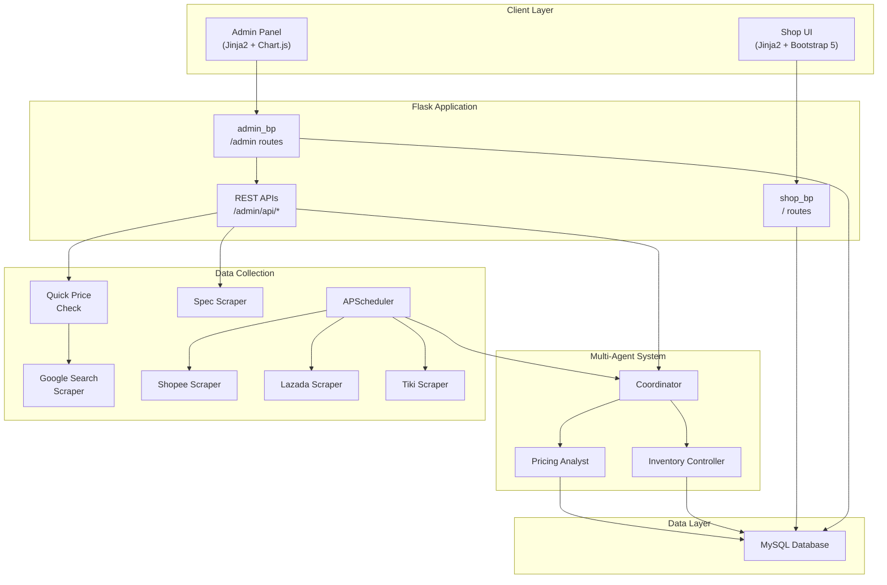
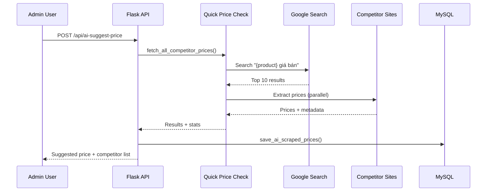
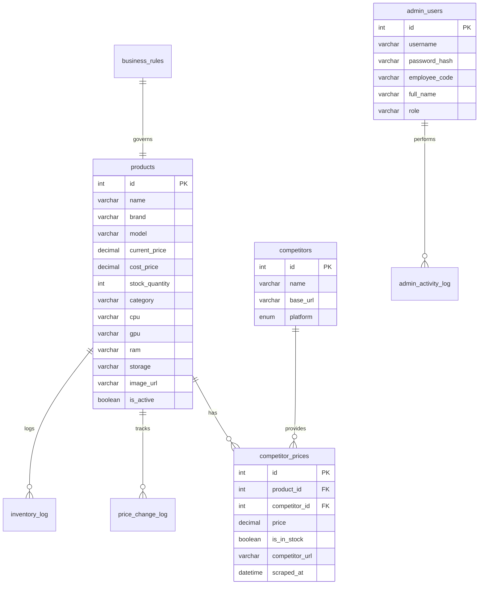

<p align="center">
  
</p>

<h1 align="center">CLap – Hệ thống Quản lý & So sánh Giá Laptop bằng AI</h1>

<p align="center">
  <strong>Multi-Agent AI Platform</strong> · So sánh giá thời gian thực · Quản lý tồn kho thông minh · Scraping tự động
</p>

<p align="center">
  
  
  
  
  
</p>

---

## Mục lục

- [Giới thiệu](#giới-thiệu)
- [Tính năng nổi bật](#tính-năng-nổi-bật)
- [Kiến trúc tổng quan](#kiến-trúc-tổng-quan)
- [Cài đặt](#cài-đặt)
- [Chạy dự án](#chạy-dự-án)
- [Cấu hình Environment](#cấu-hình-environment)
- [Cấu trúc thư mục](#cấu-trúc-thư-mục)
- [API Reference](#api-reference)
- [Hướng dẫn đóng góp](#hướng-dẫn-đóng-góp)
- [License](#license)
- [Roadmap](#roadmap)

---

## Giới thiệu

**CLap** là hệ thống quản lý cửa hàng laptop tích hợp AI, sử dụng kiến trúc **Multi-Agent** để tự động:

- **Thu thập giá** từ hơn 15 sàn TMĐT (Shopee, Lazada, Tiki, CellphoneS, FPT Shop, GearVN...)
- **Phân tích & đề xuất giá** dựa trên dữ liệu thị trường thời gian thực
- **Quản lý tồn kho** thông minh với cảnh báo tự động
- **Tra cứu thông số kỹ thuật** sản phẩm tự động từ web

Hệ thống bao gồm 2 giao diện chính:

| Giao diện | Mô tả |
|-----------|-------|
| **Shop** (`/`) | Trang khách hàng – xem sản phẩm, so sánh giá giữa các sàn TMĐT |
| **Admin** (`/admin`) | Trang quản trị – CRUD sản phẩm, AI gợi ý giá, phân tích thị trường, nhật ký hoạt động |

---

## Tính năng nổi bật

### 🤖 Multi-Agent AI System

- **Pricing Analyst Agent** – Phân tích giá đối thủ, đề xuất chiến lược giá tối ưu
- **Inventory Controller Agent** – Giám sát tồn kho, tự động đề xuất giảm giá khi tồn kho cao
- **Coordinator** – Điều phối các agent, chạy pipeline phân tích hoàn chỉnh

### 🔍 Web Scraping thông minh

- **Google Search Scraping** – Tìm giá từ kết quả tìm kiếm Google
- **Price Extraction** – Trích xuất giá từ JSON-LD, meta tags, CSS selectors, regex
- **Spec Scraper** – Tự động tra cứu thông số kỹ thuật (CPU, RAM, GPU...) từ các trang uy tín
- **Multi-threading** – Scrape song song 3-5 trang cùng lúc, tăng tốc gấp 4 lần
- **Negative Keyword Filter** – Loại bỏ kết quả phụ kiện, linh kiện

### 🛒 Shop – Giao diện khách hàng

- Banner carousel quảng cáo
- Tìm kiếm live với gợi ý autocomplete
- Lọc theo danh mục, thương hiệu, sắp xếp giá
- So sánh giá trực quan với biểu đồ thanh
- Hiển thị giá đối thủ ngay trên card sản phẩm
- Responsive – tương thích mobile

### 🔐 Admin Panel

- Đăng nhập 3 lớp: username + password + mã nhân viên
- CRUD sản phẩm với upload ảnh
- **AI gợi ý giá** – Scrape giá real-time và đề xuất
- **AI tự điền thông số** – Tra cứu specs tự động
- Nhật ký hoạt động (read-only audit log)
- Dashboard với biểu đồ Chart.js

---

## Kiến trúc tổng quan



### Luồng phân tích giá



### Database Schema



---

## Cài đặt

### Yêu cầu hệ thống

| Thành phần | Phiên bản |
|------------|-----------|
| Python | 3.12+ |
| MySQL | 8.0+ (hoặc MariaDB 10.6+) |
| Chrome | Mới nhất (cho Selenium scraping) |
| Git | 2.x+ |

### Bước 1: Clone repository

```bash
git clone https://github.com/your-username/clap-laptop-store.git
cd clap-laptop-store
```

### Bước 2: Tạo virtual environment

```bash
# Windows
python -m venv venv
venv\Scripts\activate

# macOS / Linux
python3 -m venv venv
source venv/bin/activate
```

### Bước 3: Cài đặt dependencies

```bash
pip install -r requirements.txt
```

### Bước 4: Cấu hình database

Tạo MySQL database và user:

```sql
CREATE DATABASE laptop_pricing CHARACTER SET utf8mb4 COLLATE utf8mb4_unicode_ci;
CREATE USER 'laptop_shop'@'localhost' IDENTIFIED BY 'shop123';
GRANT ALL PRIVILEGES ON laptop_pricing.* TO 'laptop_shop'@'localhost';
FLUSH PRIVILEGES;
```

### Bước 5: Cấu hình environment

```bash
cp .env.example .env
# Mở .env và chỉnh sửa các giá trị phù hợp
```

---

## Chạy dự án

### Development (Local)

```bash
python main.py
```

Ứng dụng sẽ chạy tại:
- **Shop**: [http://localhost:5000](http://localhost:5000)
- **Admin**: [http://localhost:5000/admin](http://localhost:5000/admin)

> **Tài khoản admin mặc định:**
> - Username: `admin`
> - Password: `admin123`
> - Mã nhân viên: `NV001`

---

## Cấu hình Environment

Tạo file `.env` từ `.env.example`:

| Biến | Mặc định | Mô tả |
|------|----------|-------|
| `SECRET_KEY` | `change-me-in-production` | Khóa bí mật Flask session |
| `FLASK_DEBUG` | `True` | Bật/tắt debug mode |
| `DB_HOST` | `localhost` | MySQL host |
| `DB_PORT` | `3306` | MySQL port |
| `DB_USER` | `laptop_shop` | MySQL username |
| `DB_PASSWORD` | `shop123` | MySQL password |
| `DB_NAME` | `laptop_pricing` | Tên database |
| `OPENAI_API_KEY` | *(trống)* | API key OpenAI (cho CrewAI) |
| `OPENAI_MODEL` | `gpt-4o-mini` | Model OpenAI sử dụng |
| `SCRAPE_INTERVAL_MINUTES` | `60` | Chu kỳ scraping tự động (phút) |
| `HEADLESS_BROWSER` | `True` | Chạy Chrome ẩn khi scraping |

---

## Cấu trúc thư mục

```
clap-laptop-store/
├── app/                            # Flask Application
│   ├── __init__.py                 # App factory, đăng ký blueprints
│   ├── routes_shop.py              # Routes trang khách hàng (/)
│   ├── routes_admin.py             # Routes trang quản trị (/admin)
│   ├── static/
│   │   ├── css/style.css           # Styles cho admin dashboard
│   │   ├── js/dashboard.js         # JS cho dashboard (Chart.js, sidebar)
│   │   ├── images/logo.svg         # Logo CLap
│   │   └── uploads/products/       # Ảnh sản phẩm upload
│   └── templates/
│       ├── admin/                  # Templates admin panel
│       │   ├── base.html           # Layout chính (sidebar, navbar)
│       │   ├── dashboard.html      # Dashboard tổng quan
│       │   ├── login.html          # Trang đăng nhập
│       │   ├── product_list.html   # Danh sách sản phẩm
│       │   ├── product_form.html   # Form thêm/sửa + AI features
│       │   ├── activity_log.html   # Nhật ký hoạt động
│       │   └── settings.html       # Cài đặt quy tắc kinh doanh
│       └── shop/                   # Templates trang khách
│           ├── base.html           # Layout shop (navbar, footer)
│           ├── index.html          # Trang chủ (banner, products)
│           └── product_detail.html # Chi tiết + so sánh giá
│
├── agents/                         # Hệ thống Multi-Agent
│   ├── coordinator.py              # Điều phối agents
│   ├── pricing_analyst.py          # Agent phân tích giá
│   └── inventory_controller.py     # Agent quản lý tồn kho
│
├── data_collection/                # Thu thập dữ liệu
│   ├── scraper_base.py             # Base class Selenium scraper
│   ├── shopee_scraper.py           # Scraper Shopee
│   ├── lazada_scraper.py           # Scraper Lazada
│   ├── tiki_scraper.py             # Scraper Tiki
│   ├── quick_price_check.py        # Google → giá đối thủ (real-time)
│   ├── spec_scraper.py             # Google → thông số kỹ thuật
│   └── scheduler.py                # APScheduler tự động scrape
│
├── database/                       # Data Layer
│   ├── connection.py               # Kết nối MySQL + init_db()
│   ├── crud.py                     # Tất cả CRUD operations
│   ├── schema.sql                  # DDL + seed data
│   ├── migrate_auth.py             # Migration: bảng admin_users
│   └── migrate_product_details.py  # Migration: cột chi tiết sản phẩm
│
├── config.py                       # Cấu hình tập trung
├── main.py                         # Entry point
├── requirements.txt                # Python dependencies
├── .env.example                    # Template environment variables
└── .gitignore
```

---

## API Reference

### Shop APIs

| Method | Endpoint | Mô tả |
|--------|----------|-------|
| `GET` | `/` | Trang chủ shop (hỗ trợ `?q=`, `?category=`, `?brand=`, `?sort=`) |
| `GET` | `/product/<id>` | Chi tiết sản phẩm + so sánh giá |
| `GET` | `/api/search?q=<keyword>` | Autocomplete tìm kiếm (JSON) |

### Admin APIs

| Method | Endpoint | Mô tả |
|--------|----------|-------|
| `POST` | `/admin/api/ai-suggest-price` | AI gợi ý giá (scrape real-time) |
| `POST` | `/admin/api/ai-autofill-specs` | AI tự điền thông số kỹ thuật |
| `POST` | `/admin/api/run-analysis` | Chạy phân tích Multi-Agent |
| `POST` | `/admin/api/save-competitor-prices` | Lưu giá đối thủ cho sản phẩm |
| `GET` | `/admin/api/products` | Danh sách sản phẩm (JSON) |

**Ví dụ: AI gợi ý giá**

```bash
curl -X POST http://localhost:5000/admin/api/ai-suggest-price \
  -H "Content-Type: application/json" \
  -d '{
    "product_name": "Laptop Dell Inspiron 15 3520",
    "brand": "Dell",
    "cost_price": 13000000,
    "product_id": 1
  }'
```

**Response:**

```json
{
  "success": true,
  "suggested_price": 15490000,
  "strategy": "competitive",
  "reason": "Đã quét giá từ 5 trang web...",
  "market_data": {
    "min_price": 14990000,
    "avg_price": 15960000,
    "max_price": 17490000
  },
  "competitors": [...]
}
```

---

## Hướng dẫn đóng góp

Chúng tôi hoan nghênh mọi đóng góp! Vui lòng làm theo các bước sau:

### 1. Fork repository

### 2. Tạo branch mới

```bash
git checkout -b feature/ten-tinh-nang
```

### 3. Commit theo Conventional Commits

```bash
git commit -m "feat: thêm tính năng so sánh giá theo thời gian"
git commit -m "fix: sửa lỗi parse giá từ Shopee"
git commit -m "docs: cập nhật README"
```

| Prefix | Mô tả |
|--------|-------|
| `feat` | Tính năng mới |
| `fix` | Sửa lỗi |
| `docs` | Tài liệu |
| `refactor` | Tái cấu trúc code |
| `test` | Thêm/sửa test |
| `chore` | Công việc bảo trì |

### 4. Push và tạo Pull Request

```bash
git push origin feature/ten-tinh-nang
```

Mở Pull Request trên GitHub với mô tả rõ ràng về thay đổi.

### Quy tắc code

- Tuân thủ PEP 8 cho Python
- Viết docstring cho mọi function/class
- Template HTML dùng Jinja2, CSS dùng Bootstrap 5
- Commit message bằng tiếng Anh, comment code bằng tiếng Việt

---

## License

Dự án được phân phối dưới giấy phép **MIT License**.

```
MIT License

Copyright (c) 2026 CLap

Permission is hereby granted, free of charge, to any person obtaining a copy
of this software and associated documentation files (the "Software"), to deal
in the Software without restriction, including without limitation the rights
to use, copy, modify, merge, publish, distribute, sublicense, and/or sell
copies of the Software, and to permit persons to whom the Software is
furnished to do so, subject to the following conditions:

The above copyright notice and this permission notice shall be included in all
copies or substantial portions of the Software.
```

---

## Roadmap

### v1.0 – Hiện tại

- [x] Shop frontend với so sánh giá
- [x] Admin panel với xác thực nhân viên
- [x] Multi-Agent phân tích giá tự động
- [x] Web scraping từ Google + 15 sàn TMĐT
- [x] AI gợi ý giá real-time
- [x] AI tự điền thông số kỹ thuật
- [x] Nhật ký hoạt động admin
- [x] Chạy local hoàn chỉnh

### v1.1 – Dự kiến

- [ ] Hệ thống giỏ hàng + thanh toán
- [ ] Đăng ký / đăng nhập khách hàng
- [ ] Wishlist sản phẩm yêu thích
- [ ] Thông báo khi giá giảm (email/push)
- [ ] Biểu đồ lịch sử giá theo thời gian

### v1.2 – Tương lai

- [ ] App mobile (React Native / Flutter)
- [ ] Chatbot tư vấn sản phẩm (LLM)
- [ ] So sánh sản phẩm song song
- [ ] Hệ thống đánh giá & review
- [ ] Tích hợp thanh toán VNPay / MoMo
- [ ] CDN cho ảnh sản phẩm (Cloudinary)
- [ ] Dockerize toàn bộ hệ thống

---

<p align="center">
  Made with ❤️ by <strong>CLap Team</strong>
</p>
